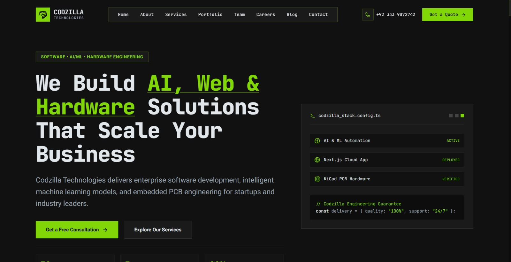

# Codezilla Technologies



Next-generation corporate agency website and content management system built for high performance, security, and developer productivity using Next.js 16, React 19, TailwindCSS v4, and Supabase.

---

## Core Capabilities

- **Next.js 16 App Router**: Server-rendered React 19 architecture offering optimal page speed, streaming SSR, and built-in search engine optimization.
- **Role-Based Access Control**: Multi-tier authentication and authorization powered by Supabase Auth and PostgreSQL Row Level Security (RLS).
- **Glassmorphism Design System**: Clean dark-mode aesthetic with fluid Framer Motion transitions and custom component design system.
- **Comprehensive Agency Suite**: Public showcases for client projects, service offerings, team rosters, customer testimonials, blog publications, and hiring workflows.
- **Administrative CMS Portal**: Centralized administration dashboard at `/admin` for real-time article publishing, job application processing, contact lead evaluation, and role management.

---

## Technology Stack

<details open>
<summary><b>Framework & Core Engine</b></summary>

| Technology | Version | Purpose |
| :--- | :--- | :--- |
| **Next.js** | `16.3.0` | React Framework utilizing App Router and React Compiler |
| **React** | `19.2.8` | Server and Client component rendering engine |
| **TypeScript** | `^5.0.0` | Type safety and autocompletion across server and client layers |

</details>

<details>
<summary><b>Database & Authentication</b></summary>

| Technology | Package | Purpose |
| :--- | :--- | :--- |
| **Supabase Postgres** | `@supabase/supabase-js` | Relational database with automated RLS policies |
| **Supabase SSR** | `@supabase/ssr` / `@supabase/server` | Cookie-based server-side session management |
| **Postgres Client** | `pg` | Direct PostgreSQL connection utilities |

</details>

<details>
<summary><b>Styling & Motion</b></summary>

| Technology | Package | Purpose |
| :--- | :--- | :--- |
| **TailwindCSS** | `^4.0.0` | Utility-first CSS framework with PostCSS support |
| **Framer Motion** | `^13.0.0` | Production animation library for micro-interactions |
| **Lucide Icons** | `lucide-react` | Clean SVG icon library |

</details>

<details>
<summary><b>Content & Utilities</b></summary>

| Technology | Package | Purpose |
| :--- | :--- | :--- |
| **Marked** | `marked` | Fast Markdown parser and compiler for blog articles |
| **ESLint** | `eslint-config-next` | Code quality enforcement and static analysis |

</details>

---

## Quick Start

### 1. Clone Repository

```bash
git clone https://github.com/umerkang66/codezilla-website.git
cd codezilla-website
```

### 2. Install Dependencies

```bash
npm install
```

### 3. Provision Environment Variables

Create a local `.env` file from the example template:

```bash
cp .env.example .env
```

Populate `.env` with your Supabase keys and main admin email:

```env
ADMIN="codzilla.company@gmail.com,admin@example.com"
NEXT_PUBLIC_SUPABASE_URL="https://your-project-id.supabase.co"
NEXT_PUBLIC_SUPABASE_PUBLISHABLE_KEY="your_supabase_publishable_key"
SUPABASE_URL="https://your-project-id.supabase.co"
SUPABASE_PUBLISHABLE_KEY="your_supabase_publishable_key"
SUPABASE_SECRET_KEY="your_supabase_secret_key"
```

### 4. Run Local Development Server

```bash
npm run dev
```

Open [http://localhost:3000](http://localhost:3000) in your browser.

---

## Documentation Index

Detailed engineering guides, architecture blueprints, database schema specifications, and deployment procedures are available in the [`docs/`](./docs) folder:

| Document | Description |
| :--- | :--- |
| [**Getting Started Guide**](./docs/GETTING_STARTED.md) | Full setup, environment configuration, database setup, and scripts |
| [**System Architecture**](./docs/ARCHITECTURE.md) | Next.js App Router design, directory structure, and security model |
| [**Database Schema Reference**](./docs/DATABASE_SCHEMA.md) | PostgreSQL tables, RLS security policies, triggers, and functions |
| [**API Endpoint Reference**](./docs/API_REFERENCE.md) | Complete reference for public and admin REST API endpoints |
| [**Admin Dashboard Guide**](./docs/ADMIN_DASHBOARD.md) | Operational manual for RBAC, user management, and CMS operations |
| [**Production Deployment**](./docs/DEPLOYMENT.md) | Deployment workflows for Vercel, Docker, Netlify, and production Supabase |

---

## License

Private repository © **Codezilla Technologies**. All rights reserved.
